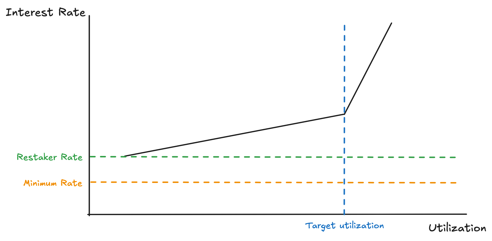

# Interest Rates

Cap's interest rate mechanism consists of benchmark rates, market rates, utilization rates, and restaker rates to ensure sustainable lending operations and proper compensation for risk-takers.

## Mechanics

The total interest that Operators pay can be summarized as:

* Minimum Rate + Utilization Rate + Restaker Rate

where Minimum rate is the maximum of the Benchmark Rate and the Market Rate

Each rate is defined as below:

1. **Benchmark Rate**: Minimum interest rates set by protocol, in fixed yearly rates
2. **Market Rate**: Dynamic rates fetched from external lending markets and oracles
3. **Utilization Rate**: Dynamic rates based on asset utilization. Calculated via a piecewise linear function and a rate multiplier
4. **Restaker Rate**: Fixed annual rate set paid by the Operator to the Delegator underwriting them

<figure><figcaption></figcaption></figure>

Let us breakdown the interest formula:

#### 1. Minimum rate

The minimum rate represents a lower bound on the interest rates, and is determined by the greater value of the preconfigured benchmark rate and the market rate. The rationale for the minimum rate stems from the Fractional Reserves. Because Cap earns base yield from the underlying idle assets, Operators must be able to provide more than the base yield in order to borrow from Cap.

For instance, if the benchmark yield set by Cap is set at 5%, and the current strategy for the Fractional Reserve of USDC is AAVE v3 earning rate is 4.5%, the minimum rate would be 5%. The minimum rate ensures that Cap’s interest rates is greater than the base yield at all times.&#x20;

#### 2. Utilization Rate

The utilization rate is a function of a piecewise linear-kink model and a rate multiplier.&#x20;

The piecewise function allows interest rates to rise linearly along the first slope up to the "kink", or target utilization rate, set at 90%, after which rates increase rapidly along the second slope. This allows short term modulation of the rate where borrowing is disincentivized beyond the kink.&#x20;

The rate multiplier is determined by the deviation of the current utilization rate from the target rate.  If the current rate is far below the target rate, and remains there for a long period, then it must be the case that the current target rate is too high to incentivize borrowing. Based on the elapsed duration of the deviation and the degree of the difference between the current utilization rate and target, the multiplier will decrease the current rate, effectively shifting the piecewise function down. This control allows for a longer term modulation, optimizing Cap's interest rates in an autonomous way.

#### 3. Restaker Rate

The restaker rate is the fixed yearly rate that Operators pay to the Delegators that collateralize them,. The rate is determined as a bilateral agreement between the Operator and Delegator, and is unique per each pair.&#x20;

Putting the pieces together, when calculating the interest rate, the system does the following:

1. Fetch market rate from oracle
2. Compare with benchmark rate (minimum floor)
3. Use higher of market or benchmark rate
4. Add utilization rate on top

## Architecture

1. **RateOracle** - Manages and provides access to various interest rate sources
2. **Lender Contract** - Handles borrowing, repayment, and interest accrual
3. **Debt Token** - Minting and burning of debt tokens, bookkeeping current interest
4. **Vault Adapter** - Calculates utilization rate using slopes and multiplier
5. **SymbioticAgentManager** - Restaker rate management for Symbiotic Delegator compensation

### Core Functions

**`nextInterstRate`**: updates interest every time there is an interaction with the Debt Token, i.e. borrowing and repaying assets and realizing interest via the [updateIndex](https://github.com/cap-labs-dev/cap-contracts/blob/main/contracts/lendingPool/tokens/DebtToken.sol#L26) modifier

```solidity
// From DebtToken.sol
function _nextInterestRate() internal returns (uint256 rate) {
    DebtTokenStorage storage $ = getDebtTokenStorage();
    address _oracle = $.oracle;
    uint256 marketRate = IOracle(_oracle).marketRate($.asset);
    uint256 benchmarkRate = IOracle(_oracle).benchmarkRate($.asset);
    uint256 utilizationRate = IOracle(_oracle).utilizationRate($.asset);

    rate = marketRate > benchmarkRate ? marketRate : benchmarkRate;
    rate += utilizationRate;
}
```

#### Utilization Rate Calculation

The Vault Adapter calculates the interest rate via the <kbd>rate</kbd> function.&#x20;

**`rate`**: Calculates utilization rate in the VaultAdapter contract

```solidity
function rate(address _vault, address _asset) external returns (uint256 latestAnswer)
```

The function processes as the following:

1. Fetch current utilization
2. Calculate elapsed time of deviation since last update, update utilization and timestamp
3. If the current utilization is higher than the target kink, the multiplier is updated according to the following formula:

```
newMultiplier = oldMultiplier × (1 + (excess_utilization / (1 - kink)) × elapsed_time × rate)
```

The interest rate is then calculated as:

<pre><code><strong>interestRate = (slope0 + slope1 × (utilization - kink) / (1e27 - kink)) × multiplier
</strong></code></pre>

4. If the current utilization is lower than the target kink, the multiplier is updated as such:

```
newMultiplier = oldMultiplier / (1 + ((kink - utilization) / kink) × elapsed_time × rate)
```

where minimum and maximum multiplier ensure the bounds of the multipliers.

The interest is then calculated as:

```
interestRate = (slope0 × utilization / kink) × multiplier
```

#### Admin Controls

**`setBenchmarkRate`**: Set benchmark rate for an asset

```solidity
function setBenchmarkRate(address _asset, uint256 _rate) external;
```

**`setRestakerRate`**: Set restaker rate for an agent

```solidity
function setRestakerRate(address _agent, uint256 _rate) external;
```

* Called by SymbioticAgentManager for Symbiotic Delegation rates

**`setMarketOracleData`**: Configure market rate oracle

```solidity
function setMarketOracleData(address _asset, IOracleTypes.OracleData calldata _oracleData) external;
```

**`setUtilizationOracleData`**: Configure utilization rate oracle

```solidity
function setUtilizationOracleData(address _asset, OracleData calldata _oracleData) external;
```

Specifically, the following functions are used for the utilization rate

**`setSlopes`**: Defines the kink and slopes per asset

```solidity
function setSlopes(address _asset, SlopeData memory _slopes) external;
```

**`setLimits`**: Defines multiplier rates, upper and lower bounds of the multiplier

<pre class="language-solidity"><code class="lang-solidity"><strong>function setLimits(uint256 _maxMultiplier, uint256 _minMultiplier, uint256 _rate) external;
</strong></code></pre>

#### Rate Queries

The rates are queried via the [Rate Oracle](../oracles.md#rate-oracle), where the respective adapter is called to fetch the rate. The market rate queries Aave rates via the [AaveAdapter](https://app.gitbook.com/u/YhHCfPpqr7SuXN3B26Zp7K85kgr1) and the utilization rate uses the [VaultAdapter](https://github.com/cap-labs-dev/cap-contracts/blob/main/contracts/oracle/libraries/VaultAdapter.sol) to set fee parameters and calculate utilization rates. Since the benchmark rate and restaker rate are static, they are looked up directly in storage.

### Vault Adapter Data Structures

The Vault Adapter data structure stores the parameters for the utilization rate.

```solidity
struct VaultAdapterStorage {
    mapping(address => SlopeData) slopeData;                    // Per-asset slope configuration
    mapping(address => mapping(address => UtilizationData)) utilizationData;  // Per-vault-per-asset utilization tracking
    uint256 maxMultiplier;                                      // Maximum slope multiplier
    uint256 minMultiplier;                                      // Minimum slope multiplier
    uint256 rate;                                               // Rate at which multiplier shifts
}
```

The slope data defines the piecewise linear function:

```solidity
struct SlopeData {
    uint256 kink;    // Kink point (utilization threshold)
    uint256 slope0;  // Slope before kink (low utilization)
    uint256 slope1;  // Slope after kink (high utilization)
}
```

where

* **kink**: Utilization threshold where slope changes (0 < kink < 1e27)
* **slope0**: Interest rate slope for utilization below kink
* **slope1**: Additional interest rate slope for utilization above kink

The utilization data defines the multiplier for longer term modulation:

```solidity
struct UtilizationData {
    uint256 multiplier;    // Dynamic multiplier (adjusts over time)
    uint256 index;         // Utilization index from vault
    uint256 lastUpdate;    // Last update timestamp
}
```

* **multiplier**: Time-based multiplier that adjusts based on utilization duration
* **index**: Cumulative utilization index from the vault
* **lastUpdate**: Timestamp of last utilization data update
